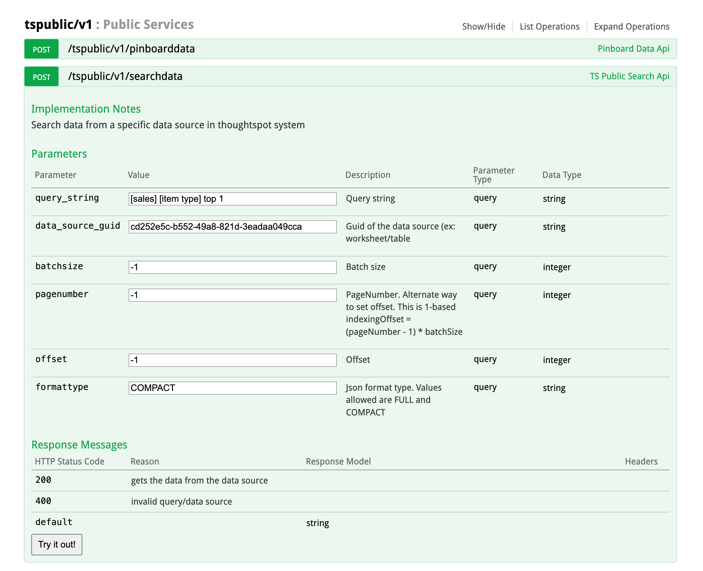
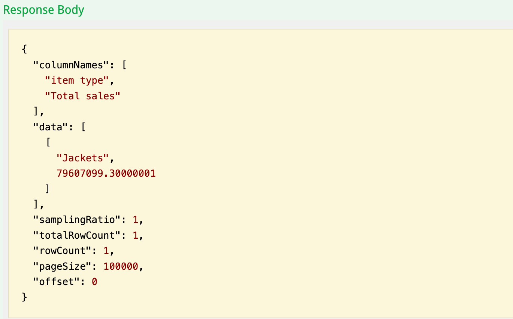
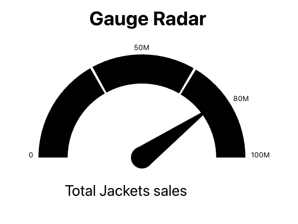
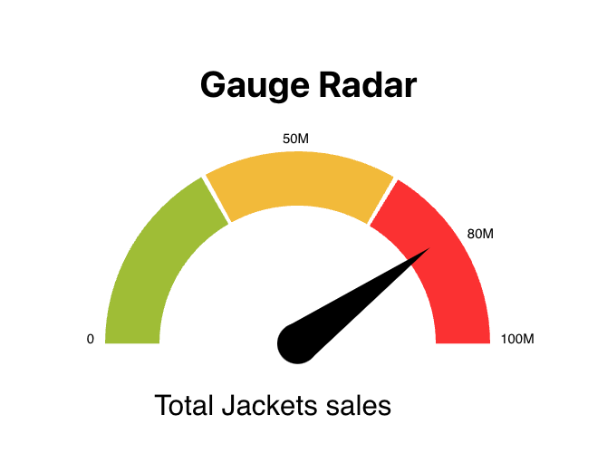
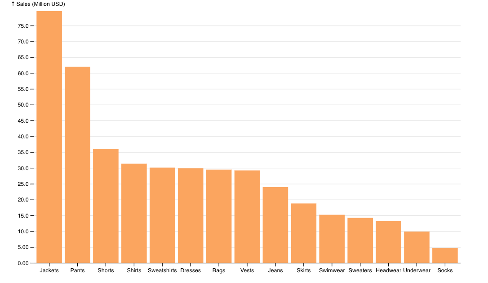

# Overview

Duration: 0:02:00

ThoughtSpot Everywhere offers different options for developers to embed analytics into their webapps. This tutorial will walk you through how to use the ThoughtSpot Everywhere REST APIs to retrieve data and map them to [D3.js](https://d3js.org/), a popular open source charting library, from a ReactJS web app. The utilities provided and API calls will be identical for other charting libraries such as [Highcharts](https://www.highcharts.com/) or [AnyChart](https://www.anychart.com/). You will just need to map the data structures per library.


# Getting Started

Duration: 0:15:00

If you don’t already have a ThoughtSpot account, go ahead and sign up for [a 30-day free trial](https://www.thoughtspot.com/trial?dev-qs-lifecycle). Once you received your credentials via the email verification, you can continue.

This tutorial will build a ReactJS webapp to embed the analytics. Make sure that you have a recent version of node.js and npm installed. You can test which version you have by executing the following command in a terminal window:


```
$ node -v && npm -v
```


You will need at least the following version. 

* Node.js : v16.3+
* NPM v8.1+

With the local environment set up, let’s start building our app. From the command line, create the app structure


```
$ npx create-react-app tsed3app
```


Then, change directories into `tsed3app`, and install `react-router-dom`:


```
$ npm install react-router-dom
```


Next, open the project in your favorite IDE. We will be using VSCode throughout this tutorial, but you can use whichever IDE you prefer. Once open, select `package.json` and set the port which your app will use, to 8000. ThoughtSpot Everywhere whitelists port 8000. If you do not perform this step, you will receive a CORS error later in the tutorial when you try to run your app.


```
"start": "PORT=8000 react-scripts start",
```


Replace the contents of index.js with the following code to set up your app to use react-router-dom:


```
import React from 'react';
import ReactDOM from 'react-dom';
import { BrowserRouter as Router } from 'react-router-dom';
import './index.css';
import App from './App';

ReactDOM.render(
<Router>
  <App />
</Router>
```


The last thing we need to do to configure our app is set a few environment variables. In a few minutes we will add some helper libraries to bind ThoughtSpot data structure to d3 and make it easy to authenticate against ThoughtSpot via the REST APIs. These helpers rely on the following environment variables to connect to your ThoughtSpot instance. Go ahead and create a new file, `.env`, in your project’s root directory (at the same level as `package.json`) with the following environment variables. If you are using the Free Trial account, you will not need to change the `REACT_APP_TS_URL` value, otherwise log into your instance via the browser and copy the domain. Remember not to include a trailing` /`. 


```
REACT_APP_TS_URL=https://try.thoughtspot.cloud
REACT_APP_TS_USERNAME=your-username@name.com
REACT_APP_TS_PASSWORD=yourPassword
```


# Add Helpers

Duration: 0:10:00

Now that we have our app configured, we are going to add a few helper classes to handle binding to D3, and authenticating and working with the ThoughtSpot Everywhere REST API. 

Positive
: The API helper classes included in this tutorial are intentionally very light. They provide convenience wrappers for authentication and the search data endpoint only. It is recommended that you use one of the more full featured libraries available on [CodeSpot](https://developers.thoughtspot.com/codespot). 

Create two folders in the src directory of your project:


```
src/components
src/components/utils
```


Then, copy the following three files from GitHub into the utils directory you just created:


* [GaugeChart.js](https://github.com/thoughtspot/quickstarts/blob/main/build-charts-with-d3/complete-app/src/components/utils/GaugeChart.js)
* [d3-helpers.js](https://github.com/thoughtspot/quickstarts/blob/main/build-charts-with-d3/complete-app/src/components/utils/d3-helpers.js)
* [thoughtspot-rest-api-v1-helpers.js](https://github.com/thoughtspot/quickstarts/blob/main/build-charts-with-d3/complete-app/src/components/utils/thoughtspot-rest-api-v1-helpers.js)


# Create Gauge Chart

Duration: 0:15:00

It’s time to put all of this preparation into action. We will create a gauge chart to show sales of the most popular item in the ThoughtSpot sample retail dataset. This dataset comes preinstalled in your trial environment and is very helpful. to experiment with how to build apps and services with ThoughtSpot Everywhere. 

Within the `src/components` folder, create a new file, `GaugeExample.js`.

Add the required imports:


```
import React, { useEffect, useRef, useState } from 'react';
import { GaugeChart } from './utils/GaugeChart'
import { getSearchData, tsLogin } from './utils/thoughtspot-rest-api-v1-helpers';
```


And, create the default function:


```
export default function GaugeExample(props) { }
```


Then, create the following constants to use within our function. The first three constants are used to authenticate against ThoughtSpot and tell the helper library which ThoughtSpot domain to append to REST API endpoints. The values of these constants use the `.env` configuration you created earlier.


```
const tsURL = process.env.REACT_APP_TS_URL;
const USER = process.env.REACT_APP_TS_USERNAME;
const PASSWORD = process.env.REACT_APP_TS_PASSWORD;
```


Next, add two more constants. The first identifies the workshops we want to query against to retrieve data. To get your worksheet id, log into your instance and navigate to** Data > Worksheets and select Sample Retail - Apparel**. In the browser URL, copy and paste the id into your code. 


```
const worksheetID = "cd252e5c-b552-49a8-821d-3eadaa049cca";
const search1 = "[sales] [item type] top 1"; //Most sold item
```


The second constant, search1 is a search term used to query data. For our Gauge Chart we want to retrieve a single item and show the sales for it. 

All that is left to do now is query ThoughtSpot and map the results to the chart. Add the following code into the GaugeExample function. Once completed, we will walk through the important aspects.


```
export default function GaugeExample(props) {
//Use React Hooks to handle state
const svg = useRef(null);
const [value, setValue] = useState(null);
const [cfg, setCfg] = useState(null);

//Use React Hooks to handle state
useEffect(() => {

    const fetchData = async () => {
        
        const responseLogin = await tsLogin(tsURL, USER, PASSWORD);
        const responseSearch1 = await getSearchData(tsURL, worksheetID, search1);
        const apiData1 = await responseSearch1.data; // Get only the data portion of the response

        var cfg = {
            label: "Sales",
            gaugeMaxValue: 100,
            units: "M"
            };
        //Pull name of the most sold item from API
        cfg.label = "Total " + apiData1[0][0] + ' sales ';

        setCfg(cfg);
        setValue( Math.round(apiData1[0][1]/1000000) ); 
    };

    fetchData();

}, []);

if (value) {
        return (
               <div className="chart-gauge">  
                    <h1>Gauge Radar</h1>
                    <GaugeChart value={value} cfg={cfg}/>
                </div>
                );
    }
    else {
        return <div> Loading chart data... </div>;
    }
}
```


Let’s break down what is going on here. First, we make an async call to ThoughtSpot and await for the response. We take advantage of the helper library to perform the heavy lifting of authenticating and calling the [searchdata API](https://developers.thoughtspot.com/docs/?pageid=search-data-api#search-data-api-ref). 


```
const responseLogin = await tsLogin(tsURL, USER, PASSWORD);
const responseSearch1 = await getSearchData(tsURL, worksheetID, search1);
const apiData1 = await responseSearch1.data; 
```


If you want to test your query before writing code, the Developer REST Playground is a fantastic resource to help you learn and test API endpoints. It is great practice to test here first, then add to your code with confidence. Let’s do this now. 

Log in your ThoughtSpot instance, tap **Develop > REST API Playground**, then tap **Try it out** in the REST API v1 Playground section. Once in the playground, tap** tspublic/v1**, then select **/tspublic/v1/searchdata **to display the endpoint’s parameters. Try adding your worksheet id and search term defined in the constants above., then tap **Try it out**.





Positive
: This tutorial uses the REST API v1 endpoints. The REST API v2 is still in beta and subject to change.

If successful, you will see the Response Body as a json payload. This is the data we will use to map to the D3 charts.





Then, when we have the results, we configure the chart and map the data to it:


```
var cfg = {
            label: "Sales",
            gaugeMaxValue: 100,
            units: "M"
            };
        //Pull name of the most sold item from API
        cfg.label = "Total " + apiData1[0][0] + ' sales ';

        setCfg(cfg);
        setValue( Math.round(apiData1[0][1]/1000000) ); 
    };
```


And, finally pass everything to the helper class to display it


```
<div className="chart-gauge">  
      <h1>Gauge Radar</h1>
      <GaugeChart value={value} cfg={cfg}/>
</div>
```


 


# Add Routes

Duration: 0:10:00

Now that our chart is all set up, all that is left to do is to add the routes and navigation to the app home page. In your IDE, select `App.js` and rename it to `App.jsx`, then replace the contents with the following code:


```
import './App.css';
import { Route, Routes} from "react-router-dom";
import GaugeExample from './components/GaugeExample';

function App() {

  return (
  
    <div className="App">
      
      <header>
       ThoughtSpot Everywhere D3 Example
      </header>
        
      <Routes>
        <Route path="/" element={<h3>Home</h3>} />
        <Route path="/GaugeExample" element={<GaugeExample />} />    
      </Routes>

      <ul>
        <li> <a className="bm-item" href="/">Home</a></li>
         <li> <a className="bm-item" href="/GaugeExample">GaugeExample</a> </li>
      </ul>
    </div>
  );
 }
 export default App;
```


# Run and Add Styling

Duration: 0:05:00

That’s it. You are ready to test your app. Save all of your changes, and start the app:


```
$ npm start
```


Once your app starts, tap on the GaugeExample, and you should see a chart appear. Nice job!





Our chart shows the number of sales for the top selling product, but it’s not that exciting. Let’s add a little color. Open src/index.css and replace the contents with the following css:


```
body {
  margin: 0;
  font-family: -apple-system, BlinkMacSystemFont, 'Segoe UI', 'Roboto', 'Oxygen',
    'Ubuntu', 'Cantarell', 'Fira Sans', 'Droid Sans', 'Helvetica Neue',
    sans-serif;
  -webkit-font-smoothing: antialiased;
  -moz-osx-font-smoothing: grayscale;
}

code {
  font-family: source-code-pro, Menlo, Monaco, Consolas, 'Courier New',
    monospace;
}

.content{
	margin: 90px;
}

/* Styles for Interactive Radar Chart  */

.interactive-radar-container .legende {
	cursor: pointer;
}
.interactive-radar-container .recta {
	opacity: 0.1;
	cursor: pointer;
}
.interactive-radar-container .legend {
	font-family: 'Futura', sans-serif;
	fill: #333333;
}
.interactive-radar-container .tooltip {
	fill: #333333;
}
.interactive-radar-container {
	font-size: 12px;
	font-weight: 300;
	fill: #242424;
	text-align: center;
	cursor: default;
	margin-left: 20px;
	margin-top: 40px;
	padding: 10px;
}

/* Styles for GaugeChart */

.chart-gauge {
   width: 400px;
   margin: 100px auto 
}
.chart-gauge .chart-first {
   fill: #9FBD35;
}
.chart-gauge .chart-second {
   fill: #F2BA3A;
}
.chart-gauge .chart-third {
   fill: #FB3033;
}
.chart-gauge .needle, .needle-center {
   fill: #000000;
}
.chart-gauge .text {
   color: "#112864";
   font-size: 16px;
}
.chart-gauge svg {
   font: 10px sans-serif;
}

/* Styles for Bubble US Map */

.chart-map {
   width: 100%;
   margin: 10px auto; 
}

/* Word cloud Styles*/

.word-cloud {
  font-family: sans-serif;
  text-align: center;
  margin: 10px auto; 
}
```


Save your changes, and check out the chart now. Much better!





# Add a Bar Chart

Duration: 0:15:00

Another very common chart for displaying data is a Bar Chart. ThoughtSpot natively supports Bar Charts in embed components, but if you are using the search data API, it is quite likely that you will be asked to map ThoughtSpot analytics to a Bar Chart. Now that you have all the helpers set up in your app, doing so is very easy.

Go ahead and create a new file `src/components/BarExample.js` and paste in the following code. 


```
import React, { useEffect, useRef, useState } from 'react';
import { getSearchData, tsLogin } from './utils/thoughtspot-rest-api-v1-helpers';
import { BarChart } from './utils/d3-helpers';
import * as d3 from "https://cdn.skypack.dev/d3@7";


const tsURL = process.env.REACT_APP_TS_URL;
const USER = process.env.REACT_APP_TS_USERNAME;
const PASSWORD = process.env.REACT_APP_TS_PASSWORD;

const worksheetID = "cd252e5c-b552-49a8-821d-3eadaa049cca";
const search = "[sales] [item type]";

export default function BarExample(props) {

    //Use React Hooks to handle state
    const svg = useRef(null);
    const [data, setData] = useState(null);

    //Use React Hooks to handle state
    useEffect(() => {

        const fetchData = async () => {
            const responseLogin = await tsLogin(tsURL, USER, PASSWORD);
            const responseSearch = await getSearchData(tsURL, worksheetID, search);
            const newData = await responseSearch.data;
            setData(newData);

            const formattedData = [];
            newData.forEach(function(item, index) {
                var chartRow = {
                    "name": item[0], 
                    "value": item[1]/1000000
                };
                formattedData[index] = chartRow;
            });

            formattedData["columns"] = ["name", "value"];
        
            const chart = BarChart(formattedData, {
              x: d => d.name,
              y: d => d.value,
              xDomain: d3.groupSort(formattedData, ([d]) => -d.value, d => d.name), // sort by descending value
              yFormat: ",.3n",
              yLabel: "↑ Sales (Million USD)",
              width : 800,
              height: 500,
              color: "rgb(251, 165, 95)",
              unit: "M"
            });

            //svg is a mutable ref object whose .current property is initialized to the passed argument (initialValue). 
            //See. https://reactjs.org/docs/hooks-reference.html#useref
            if (svg.current && chart !== undefined) {
                svg.current.appendChild(chart)
            }
        };

        fetchData();

    }, []);

    if (data) {
        	return ( < div ref = {svg}/>);
        }
        else {
            return <div > Loading chart data... < /div>;
        }
    }
```


This code should look very familiar to you now: we retrieve environment variables for authentication, call` getSearchData` passing in a worksheet id and search term, and map the results. 

Next, add the imports and routing into `src/App.jsx`. Your final file should look like this:


```
import './App.css';
import { Route, Routes} from "react-router-dom";
import GaugeExample from './components/GaugeExample';
import BarExample from './components/BarExample';

function App() {

  return (
  
    <div className="App">
      
      <header>
       ThoughtSpot Everywhere D3 Example
      </header>
        
      <Routes>
        <Route path="/" element={<h3>Home</h3>} />
        <Route path="/GaugeExample" element={<GaugeExample />} />
        <Route path="/BarExample" element={<BarExample />} />
        
      </Routes>

      <ul>
        <li> <a className="bm-item" href="/">Home</a></li>
         <li> <a className="bm-item" href="/GaugeExample">GaugeExample</a> </li>
         <li> <a className="bm-item" href="/BarExample">BarExample</a> </li>
       </ul>
    </div>
  );
 }
 export default App;
```


Save and run your application, this time tapping on the Bar Example link. 





# Summary

Duration: 0:03:00

Throughout this tutorial you learned how to use the ThoughtSpot REST APIs to search for data and map it to the D3 charting library. You created a Gauge and Bar Chart to demonstrate how the helper libraries assist in quickly mapping result sets. You can access the complete application from this tutorial [here](https://github.com/thoughtspot/quickstarts/tree/main/build-charts-with-d3/complete-app). In addition, if you want additional chart examples including wordcloud, sunburst, radial, and more, check out the D3 Sample showcase in [CodeSpot](https://developers.thoughtspot.com/codespot/d3-sample-showcase). 
