id: transform_data_with_dbt_snowflake
summary: Build your data pipeline with dbt & Snowflake
categories: Getting Started
environments: web
status: Published 
tags: Getting Started, Data Engineering, dbt, ThoughtSpot, Visual Embed SDK, Visualization
authors: Quinton Wall

# Build the Modern Data Stack with Snowflake, dbt, and ThoughtSpot
<!-- ------------------------ -->
## Overview 
Duration: 5

Today's businesses rely on the most up-to-data information to take advantage of market changes, understand trends, and grow. The modern data stack is critical to unlocking this data by using modern technologies  to store, transform, and visualize this data. During this tutorial, you will learn how to use some of the major components of the modern data stack to derive business insights using modern software development practices.

[modern data stack diagram]

The key technologies in the modern data stack you will use are:

[Snowflake](https://signup.snowflake.com/?utm_source=google&utm_medium=paidsearch&utm_content=go-eta-ld-free-trial&utm_term=c-g-snowflake-e&utm_campaign=na-en-Branded&_bt=470247374327&_bk=snowflake&_bm=e&_bn=g&_bg=64805047909&gclid=Cj0KCQjw18WKBhCUARIsAFiW7JwA-C_HmNQzG_OFKhM1Hn9vlW6EAs-9mveiMXychVbbK34lh4vGfHsaAv4NEALw_wcB&gclsrc=aw.ds) is the Data Cloud for storing and managing data. It simplifies data pipelines, so you can focus on data and analytics instead of infrastructure management.

[dbt](https://www.getdbt.com/) is a transformation workflow that lets teams quickly and collaboratively deploy analytics code following software engineering best practices like modularity, portability, CI/CD, and documentation. Now anyone who knows SQL can build production-grade data pipelines. It transforms data in the warehouse, leveraging cloud data platforms like Snowflake.

[ThoughtSpot](https://www.thoughtspot.com/) is the UX layer for your data. It provides powerful, naturual language search and rich visaulization tools for self-service analytics. In addition, developers can share and embed data anywhere using APIs and SDKs in leading programming languages. 

Let's get started.

### What You'll Use During the Lab

* A trial [Snowflake account](https://trial.snowflake.com/) with `ACCOUNTADMIN` access

* A [dbt Cloud account](https://www.getdbt.com/signup/) 

* A [ThoughtSpot](https://www.thoughtspot.com/trial?tsref=trialtse) account

### What You'll Learn

* How to build scalable data transformation pipelines using dbt & Snowflake
* How to use ThoughtSpot to search and visualize data, and embed into web apps 
* How to connect Snowflake,dbt, and ThoughtSpot to deliver immediate value from the modern data stack

<!-- ------------------------ -->

## Let's Get Started With Snowflake

Duration: 5

1. To create a Snowflake trial account, follow [this link](https://signup.snowflake.com/) and fill out the form before clicking `Continue`. You’ll be asked to choose a cloud provider and for the purposes of this workshop any of them will do. After checking the box to agree to the terms, click `Get Started`.

   Once your account is created you’ll receive an email confirmation. Within that email, click the `Click to Activate` button and then create your login credentials. You should now be able to see your account!

2. For a detailed Snowflake UI walkthrough, please refer [here](https://docs.snowflake.com/en/user-guide/ui-snowsight-gs.html#getting-started-with-snowsight). From here on out we’ll be using the new Snowflake UI (Snowsight) and any Snowflake specific directions you see will be for Snowsight. Feel free to use the Snowflake Classic UI as it won’t affect your dbt experience, but it may change the location of certain features within Snowflake.

3. Next, we will create a schema and some basic tables. Too do this,  select the `Worksheets` tab , then click the blue `Worksheet` button in the upper right hand corner of the page to create a new worksheet. 

   [

6. Create the database and schema

   ```sql
   create database thoughtspot;
   create schema thoughtspot.dbtqs;
   ```

7. Now create three tables:

   1. 1. Customers

         ```sql
         create table thoughtspot.dbtqs.customers 
         ( id integer,
           first_name varchar,
           last_name varchar
         );
         
         copy into thoughtspot.dbtqs.customers (id, first_name, last_name)
         from 's3://dbt-tutorial-public/jaffle_shop_customers.csv'
         file_format = (
           type = 'CSV'
           field_delimiter = ','
           skip_header = 1
           );
         ```

         

      2. Orders

         ```sql
         create table thoughtspot.dbtqs.orders
         ( id integer,
           user_id integer,
           order_date date,
           status varchar,
           _etl_loaded_at timestamp default current_timestamp
         );
         
         copy into thoughtspot.dbtqs.orders (id, user_id, order_date, status)
         from 's3://dbt-tutorial-public/jaffle_shop_orders.csv'
         file_format = (
           type = 'CSV'
           field_delimiter = ','
           skip_header = 1
           );
         ```

         

      3. Payments

         ```sql
         create table thoughtspot.dbtqs.payment 
         ( id integer,
           orderid integer,
           paymentmethod varchar,
           status varchar,
           amount integer,
           created date,
           _batched_at timestamp default current_timestamp
         );
         
         copy into thoughtspot.dbtqs.payment (id, orderid, paymentmethod, status, amount, created)
         from 's3://dbt-tutorial-public/stripe_payments.csv'
         file_format = (
           type = 'CSV'
           field_delimiter = ','
           skip_header = 1
           );
         ```

         

   2. Once complete, execute the following statement to confirm everything is set up correctly

      ```sql
      select * from thoughtspot.dbtqs.customers;
      select * from thoughtspot.dbtqs.orders;
      select * from thoughtspot.dbtqs.payment;
      ```

6. Great! Now it’s time to set up dbt Cloud.

## Launching dbt Cloud via Partner Connect

Duration: 5

1. We are going to use [Snowflake Partner Connect](https://docs.snowflake.com/en/user-guide/ecosystem-partner-connect.html) to set up your dbt Cloud account and project. Using Partner Connect will allow you to create a complete dbt account with your [Snowflake connection](https://docs.getdbt.com/docs/dbt-cloud/cloud-configuring-dbt-cloud/connecting-your-database#connecting-to-snowflake), [managed repository](https://docs.getdbt.com/docs/dbt-cloud/cloud-configuring-dbt-cloud/cloud-using-a-managed-repository), [environments](https://docs.getdbt.com/docs/guides/managing-environments), and credentials with just a few clicks.

2. In the Snowflake UI, click on the home icon in the top left hand corner of the screen. To access Partner Connect, click on your user and then click `Partner Connect`.

   [](https://github.com/Snowflake-Labs/sfquickstarts/blob/master/site/sfguides/src/accelerating_data_teams_with_snowflake_and_dbt_cloud_hands_on_lab/assets/Snowflake_open_partner_connect.png)

   Check to make sure your role is set as the ACCOUNTADMIN role. If you do not see `Partner Connect` in the dropdown, select `Admin` from the lefhand navigation and choose` Partner connect` there If you're using the classic console, the `Partner Connect `button will be in the top bar just right of center.

3. Find the dbt tile by typing `dbt` into the `Search Partner Connect` search bar. Click on the dbt tile.

   [](https://github.com/Snowflake-Labs/sfquickstarts/blob/master/site/sfguides/src/accelerating_data_teams_with_snowflake_and_dbt_cloud_hands_on_lab/assets/Snowflake_search_partner_connect.png)

4. You should now see a popup that says `Connect to dbt` that contains all of the associated objects created by Partner Connect. Click on the `Optional Grant` dropdown menu and add `Thoughtspot` in the text box. This will grant your new dbt user role access to the database. Once that’s entered, click `Connect`. This will create a dedicated dbt user, database, warehouse, and role for your dbt Cloud trial.

5. 

   

6. When you see the popup that says `Your partner account has been created`, click on `Activate`.

7. You should be redirected to a dbt Cloud registration page. Fill out the form and make sure to save the password somewhere for login in the future.

   [](https://github.com/Snowflake-Labs/sfquickstarts/blob/master/site/sfguides/src/accelerating_data_teams_with_snowflake_and_dbt_cloud_hands_on_lab/assets/dbt_Cloud_registration.png)

8. Click on `Complete Registration`. You should now be redirected to your dbt Cloud account, complete with a connection to your Snowflake account, a deployment and a development environment, as well as a sample job.

   [](https://github.com/Snowflake-Labs/sfquickstarts/blob/master/site/sfguides/src/accelerating_data_teams_with_snowflake_and_dbt_cloud_hands_on_lab/assets/dbt_Cloud_home_page.png)

9. To help you version control your dbt project we have connected it to a [managed repository](https://docs.getdbt.com/docs/dbt-cloud/cloud-configuring-dbt-cloud/cloud-using-a-managed-repository), which means that dbt Labs will be hosting your repository for you. This will give you access to a git workflow without you having to create and host the repository yourself. You will not need to know git for this workshop; dbt Cloud will help guide you through the workflow. In the future, when you're developing your own project, feel free to use [your own repository](https://docs.getdbt.com/docs/dbt-cloud/cloud-configuring-dbt-cloud/cloud-installing-the-github-application). 

   

## Setup project

Duration: 7

1. Now that our dbt Cloud account is set up, let's make a few changes to the automated Snowflake connection to use the `THOUGHTSPOT` database. Once you are logged in, click the cog in the right hand corner, select `Account Settings`, then `Linked Account`s from the lefthand navigation. Finally, select `Partner Connect Trial`

2. 

3. Edit the configuration details and change the  schema to THOUGHTSPOT

4. 

5. let’s open up the IDE (Integrated Development Environment) and familiarize ourselves with some of the key product features. Click on the hamburger menu in the upper left hand corner of the screen and then click `Develop`.

   [](https://github.com/Snowflake-Labs/sfquickstarts/blob/master/site/sfguides/src/accelerating_data_teams_with_snowflake_and_dbt_cloud_hands_on_lab/assets/dbt_Cloud_hamburger_menu.png)

   [](https://github.com/Snowflake-Labs/sfquickstarts/blob/master/site/sfguides/src/accelerating_data_teams_with_snowflake_and_dbt_cloud_hands_on_lab/assets/dbt_Cloud_develop_button.png)

6. When the IDE is done loading, click on the green `initialize your project` button in the upper left hand corner of the screen. The initialization process creates a dbt project in the file tree on the left hand side of the screen with all of the core dbt files and folders needed.

   [](https://github.com/Snowflake-Labs/sfquickstarts/blob/master/site/sfguides/src/accelerating_data_teams_with_snowflake_and_dbt_cloud_hands_on_lab/assets/dbt_Cloud_initialize_project_button.png)

7. After the initialization is finished, you should see a new folder structure in the left hand sidebar. As we move through the workshop we’ll be sure to touch on a few key files and folders that we’ll work with to build out our project.

8. Next click `commit` in the upper left hand corner to commit the new files and folders from the initialize step. We always want our commit messages to be relevant to the work we’re committing, so be sure to provide a message like `initialize project` and click `Commit` in the pop-up window.

   [](https://github.com/Snowflake-Labs/sfquickstarts/blob/master/site/sfguides/src/accelerating_data_teams_with_snowflake_and_dbt_cloud_hands_on_lab/assets/dbt_Cloud_initial_commit.png)

   [](https://github.com/Snowflake-Labs/sfquickstarts/blob/master/site/sfguides/src/accelerating_data_teams_with_snowflake_and_dbt_cloud_hands_on_lab/assets/dbt_Cloud_initial_commit_message.png)

9. [Committing](https://www.atlassian.com/git/tutorials/saving-changes/git-commit) your work here will save it to the managed git repository that was created during the Partner Connect signup. This initial commit is the only commit that will be made directly to our `main` branch and from here on out we’ll be doing all of our work on a development branch. This allows us to keep our development work separate from our production code.

10. Once commit, go ahead and tap create new branch, giving the name `thoughtspot-tutorial`.  Once it is created, we can go ahead and delete a few example models that were created when we initialized the project. Expand the models folder and click the ... to the right of example, then choose `delete`

   [](https://github.com/Snowflake-Labs/sfquickstarts/blob/master/site/sfguides/src/accelerating_data_teams_with_snowflake_and_dbt_cloud_hands_on_lab/assets/dbt_Cloud_example_models_file_tree.png)

   

## Build your first model

Duration: 12

Now that we have our project set up, let's make some new models via dbt. Click the `models` folder and tap ..., then select `New file`. Name it `models/customers.sql`. Paste the following query and save. 

```sql
with customers as (

    select
        id as customer_id,
        first_name,
        last_name

    from thoughtspot.dbtqs.customers

),

orders as (

    select
        id as order_id,
        user_id as customer_id,
        order_date,
        status

    from thoughtspot.dbtqs.orders

),

customer_orders as (

    select
        customer_id,

        min(order_date) as first_order_date,
        max(order_date) as most_recent_order_date,
        count(order_id) as number_of_orders

    from orders

    group by 1

),

final as (

    select
        customers.customer_id,
        customers.first_name,
        customers.last_name,
        customer_orders.first_order_date,
        customer_orders.most_recent_order_date,
        coalesce(customer_orders.number_of_orders, 0) as number_of_orders

    from customers

    left join customer_orders using (customer_id)

)

select * from final
```

Save your changes, and enter `dbt run` in the command line prompt at the bottom of the dbt browser window and tap `enter`.


If everything is successful, you should see a pass message.


## Building models to separate logic

Duration: 12

1. To get started with development for our project, we’ll need to create a new git branch for our work. Clicking on the green `create new branch` button in the upper left hand corner of the screen will bring up a window to name your branch. We’ll call our branch `thoughtspot-tutorial`. After entering in the name click `Submit`.

   [](https://github.com/Snowflake-Labs/sfquickstarts/blob/master/site/sfguides/src/accelerating_data_teams_with_snowflake_and_dbt_cloud_hands_on_lab/assets/dbt_Cloud_create_new_branch_button.png)

   

   As a best practice in SQL, you should separate logic that cleans up your data from logic that transform. We already have a good start with our table structure. dbt makes it extremely easy to extend this to further separate out any logic into separate models. We will create the following structure


3. Create a new SQL file, `models/stg_customers.sql`, with the SQL from  `customers`  in our original query.

   ```sql
   select
       id as customer_id,
       first_name,
       last_name
   
   from thoughtspot.dbtqs.customers
   ```

   

4. Create a second new SQL file, `models/stg_orders.sql`, with the SQL from  `orders` in our original query.

   ```sql
   select
       id as order_id,
       user_id as customer_id,
       order_date,
       status
   
   from thoughtspot.dbtqs.orders
   ```

5. Then, edit models/customers.sql to include these models.

   ```sql
   with customers as (
   
       select * from {{ ref('stg_customers') }}
   
   ),
   
   orders as (
   
       select * from {{ ref('stg_orders') }}
   
   ),
   
   customer_orders as (
   
       select
           customer_id,
   
           min(order_date) as first_order_date,
           max(order_date) as most_recent_order_date,
           count(order_id) as number_of_orders
   
       from orders
   
       group by 1
   
   ),
   
   final as (
   
       select
           customers.customer_id,
           customers.first_name,
           customers.last_name,
           customer_orders.first_order_date,
           customer_orders.most_recent_order_date,
           coalesce(customer_orders.number_of_orders, 0) as number_of_orders
   
       from customers
   
       left join customer_orders using (customer_id)
   
   )
   
   select * from final
   
   ```

6. Build your models

   If everything looks right, your Lineage view after saving `models/customers.sql` should look like this. 

   

   All that is left to do is build your models using `dbt run`. This time, when you performed a `dbt run`, separate views/tables were created for `stg_customers`, `stg_orders` and `customers`. dbt inferred the order to run these models. Because `customers` depends on `stg_customers` and `stg_orders`, dbt builds `customers` last. You do not need to explicitly define these dependencies.

## Test and document models

Duration: 12

dbt provides integrated testing and documentation tools to make it very easy to ensure your models perform as expected. The ThoughtSpot dbt wizard also uses the generated documents to introspect the schema. 

### Create Tests 

To add tests to your project:

1. Create a new YAML file in the `models` directory, named `models/schema.yml`
2. Add the following contents to the file:

```yaml
version: 2

models:
  - name: customers
    columns:
      - name: customer_id
        tests:
          - unique
          - not_null

  - name: stg_customers
    columns:
      - name: customer_id
        tests:
          - unique
          - not_null

  - name: stg_orders
    columns:
      - name: order_id
        tests:
          - unique
          - not_null
      - name: status
        tests:
          - accepted_values:
              values: ['placed', 'shipped', 'completed', 'return_pending', 'returned']
      - name: customer_id
        tests:
          - not_null
          - relationships:
              to: ref('stg_customers')
              field: customer_id

```

3. Run `dbt test`, and confirm that all your tests passed.

   

### Create Tests 

Adding [documentation](https://docs.getdbt.com/docs/building-a-dbt-project/documentation) to your project allows you to describe your models in rich detail, and share that information with your team. Here, we're going to add some basic documentation to our project.

1. Update your `models/schema.yml` file to include some descriptions, such as those below.

   ```yaml
   version: 2
   
   models:
     - name: customers
       description: One record per customer
       columns:
         - name: customer_id
           description: Primary key
           tests:
             - unique
             - not_null
         - name: first_order_date
           description: NULL when a customer has not yet placed an order.
   
     - name: stg_customers
       description: This model cleans up customer data
       columns:
         - name: customer_id
           description: Primary key
           tests:
             - unique
             - not_null
   
     - name: stg_orders
       description: This model cleans up order data
       columns:
         - name: order_id
           description: Primary key
           tests:
             - unique
             - not_null
         - name: status
           tests:
             - accepted_values:
                 values: ['placed', 'shipped', 'completed', 'return_pending', 'returned']
         - name: customer_id
           tests:
             - not_null
             - relationships:
                 to: ref('stg_customers')
                 field: customer_id
   
   ```

2. Run `dbt docs generate` to generate the documentation for your project. dbt introspects your project and your warehouse to generate a json file with rich documentation about your project. 

3. Now that you project is complete, make sure that everything is saved and commit it to your repo by tapping the commit button,  providing a commit message, then choosing `merge to main` once the commit is successful.

   


## Schedule a job

Duration: 5

All that is left is to deploy your job/project.

1. Tap on `Deploy` and select `Environments`

2. Select `Deployment`, and tap `Settings`, then `Edit`

3. Scroll down to the very bottom until you see Schema. Change the value to all upper case. Eg: the generated schema credentials for my environment was dbt_QWall. It needs to be DBT_QWALL.  Save you changes 

   1. NOTE: This is to resolve an issue with the current build of the ThoughtSpot+dbt Wizard which will be fixed in the next release.

4. Once you changes are save, tap Deployment in the breadcrumb menu and select `Partner Connect Trial Job`

5. Tap settings to confirm generate docs on run is checked.

   

6. Tap `Partner Connect Trial Job` from the breadcrumb menu to return to the job run history page.

7. Tap Run now. In about a minute you should see that your job has run successfully. Our dbt project is ready to go!

   


## Get started with ThoughtSpot

Duration: 12

Now that you've created your  models, the next step is help business users derive insights from the data. This is where ThoughtSpot works as the user experience layer for the modern data stack. ThoughtSpot provides self-service analytics to allow users to find the answers they need and uncover additional insights they need to make better, more informed decisions. 

The first step is to [sign up for a free trial account](https://www.thoughtspot.com/trial?tsref=trialtse). In a few minutes you will receive a verification email. Complete the steps to access your ThoughtSpot environment. Initially, you will be presented with a product tour, feel free to follow through the tour or tap the ThoughtSpot logo to skip.


### Connect to Snowflake 

The first thing that we need to do is create a connection to Snowflake. Tap the `data` tab from the top menu , then `connections` from the left hand navigation, and finally the Snowflake tile. Make sure you have your snowflake account open in an other browser window. You will need some configuration information to complete the wizard

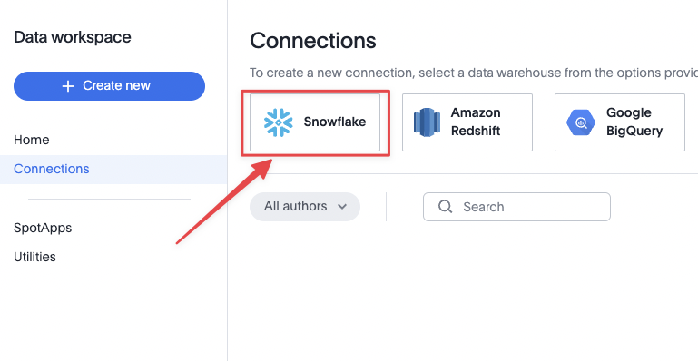

Follow the connection wizard using the information below, giving your connection the name `ts+dbt_tutorial`.

| Field name                    | Value                                                        |
| ----------------------------- | ------------------------------------------------------------ |
| Account name or snowflake URL | This is the 8 digit snowflake instance number. You can access via the snowflake URL line. 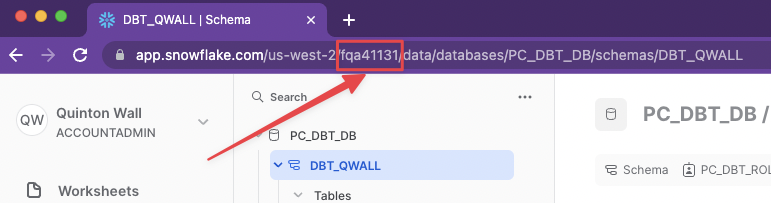 |
| User                          | The username you signed up with in Snowflake                 |
| Password                      | Your snowflake password                                      |
| Role                          | PC_DBT_ROLE                                                  |
| Data Warehouse                | PC_DBT_WH                                                    |
| Database                      | PC_DBT_DB                                                    |

Once you have entered your configuration details and tapped continue, ThoughtSpot will retrieve a list of schemas your account has access to. You should see a  schema with a unique name based off your id. For example, in the image below, my schema is `DBT_QWALL`  If you do not, double check your configuration details above.  

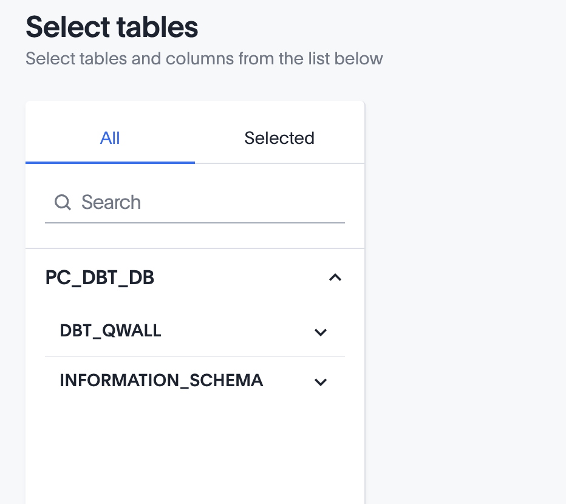

Go ahead and tap `Create Connection`. For now, all we need is the snowflake connection to be established correctly.


## Create Worksheets 

Duration: 15

Now that we have our connection to Snowflake established, we can take advantage of the models created in dbt to dynamically create worksheets and liveboards within ThoughtSpot.You can think of a worksheet as a normalized view of the data designed for the business, and liveboards as dynamic dashboards with the ability to continuously drill into the information to uncover insights.

ThoughtSpot understands dbt yaml definitions to help us dynamically create everything.  Tap on `data` in the top menu, then this time, choose `utilities`. The utilities section contains a number of tools to help you with with data on the platform. We are going to take advantage of the dbt integration wizard. Go ahead and tap on the open dbt integration wizard button. 

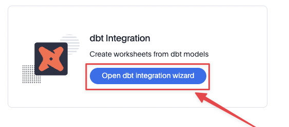

Within the wizard, select `ts+dbt_tutorial` as the data warehouse.  This will automatically set the database to `PC_DBT_DB`. Next, connect to your dbt project via dbt cloud with the  information below. 


| Field name | Value                                                        |
| ---------- | ------------------------------------------------------------ |
| API Key    | Within dbt Cloud, tap the cog in the top right, select `Account Settings` > `API Access`. Scroll down and copy the API key. |
| Account Id | Within dbt Cloud, make sure you are in the project you created earlier in this tutorial, then get account ID from the URL as shown below |
| Project Id | You can grab the project id from same URL as account id      |

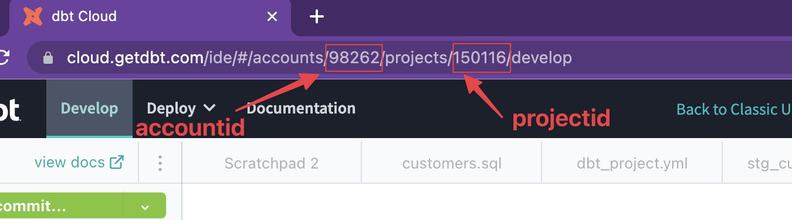

Once you have entered all the fields, tap `next`. You will be presented with a list of folders to import. Your project has just one folder, creatively named `models` which contains your 3 models. Select that folder and tap `Next`. 

Review the dbt tables you want. In our tutorial, we want them all, so you can tap `Finish`.

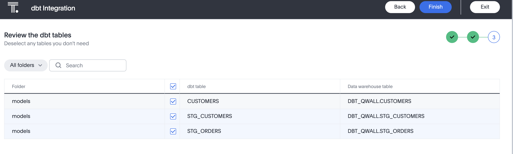

The wizard will now create tables and worksheets (logical views of data) within ThoughtSpot based on your models. If everything is successful, you will see two worksheets that are ready to search on. The great this is that all your modeling work to create the Customers table is applied to your worksheet. Tap Exit to finish the wizard.

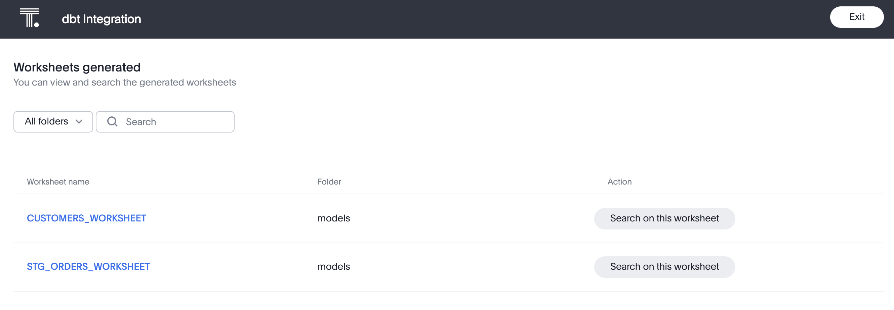


### Add Synonyms

We can take advantage of some additional features in ThoughtSpot to make it easier for data to be searched. Many businesses use different terms across business units or in different countries. For example, some parts of the company might use "Last Name" whereas others use "Surname". ThoughtSpot allows you to assign synomyms to columns for easier searching. We will add two to the customers table.

Tap `Data`, and select `Customers_Worksheet` from the list, being careful not to select the `Customers` table by accident. There is no problem doing so, but worksheets are the logical view that we want to work with here. 

Then, scroll to the right until you see the Synonyms column. In the `Last_Name` row, add the `Surname`. Then in the `Most_Recent_Order` row add `Last Order` as a synonyms. Finally, tap `Save Changes`.

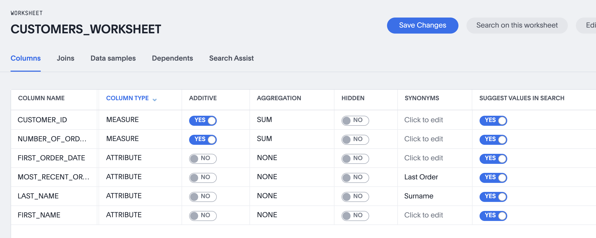

## Create Answers & Liveboards

Duration: 10

Let's go ahead an start searching our data. Tap `Search Data` from the top menu then, tap `choose sources`. Select CUSTOMERS_WORKSHEET and tap `Done`.

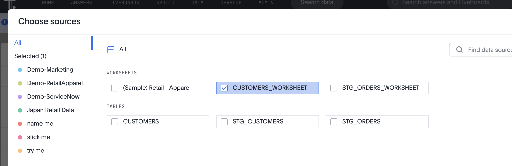

You will now be in the ThoughtSpot search interface. Go ahead and enter the following search term in the search box: ,, Surname, NUMBER_OF_ORDERS monthly and tap Go. This will create a line chart which isn't exact what we want. Tap the chart icon and select Stacked Column,  You will now see a chart showing March was a big month in sales. Hover over the colored blocks to see how many orders a customer made in that month. (Customer surnames are a single letter in the sample data we loaded into Snowflake). You might have noticed that we used the Surname synonym too. Nice job!


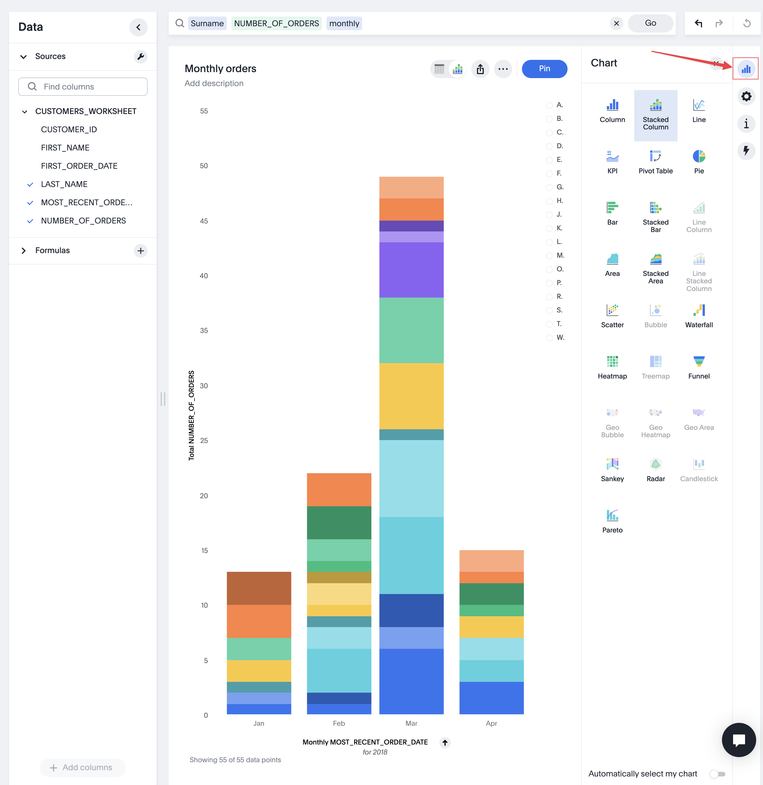

Rename the search to "**Monthly orders**", then tap the` ...` and select `Save`, and finally` Save answer.`

Next, we want to pin it to a Liveboard. You can think of a Liveboard as a collection of related Answers to help you run your business. We want a liveboard to know more about our orders and customers. Tap the Pin button, Select Create Liveboard and call it Customer Insights. Then tap the blue tick and Pin to pin it to your new board.


Let's create one more answer. Tap `Search data` to start a new search. Your `customers_worksheet` should still be selected. This time, we want to keep track of repeat customers. Add the following search `count CUSTOMER_ID NUMBER_OF_ORDERS >= 2` and Tap `Go`. ThoughtSpot knows this is a single result and will display the data accordingly. Rename the answer to "Gold Customers" and tap `Pin` to add it to your Liveboard.

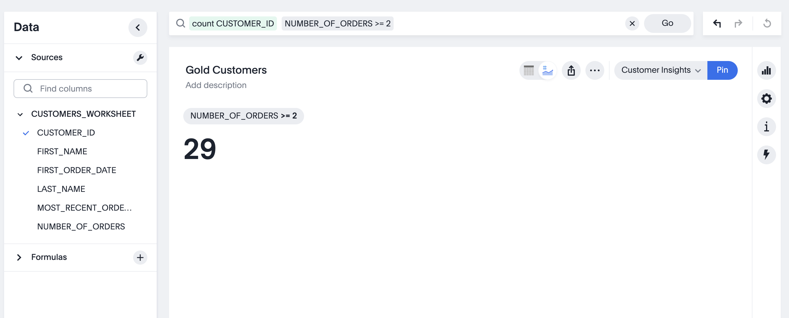

Finally, tap on `Liveboards` from the Top Navigation and select `Customer Insights`.

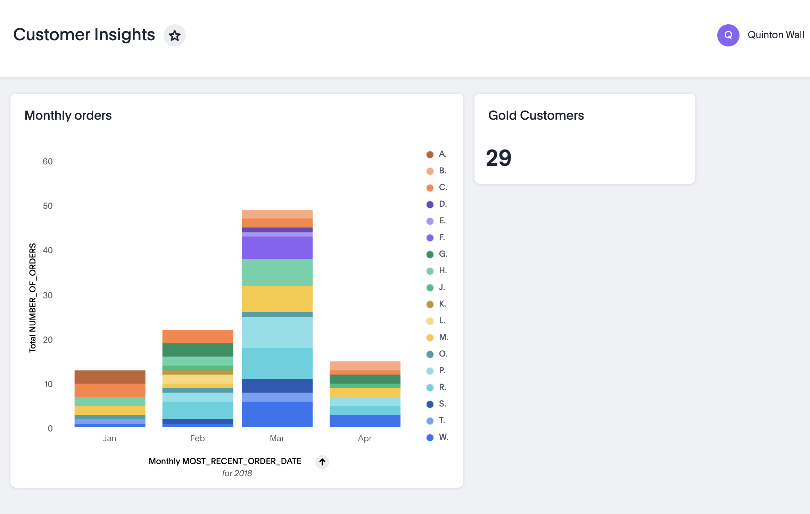

Congratulations. You've created your first visualizations using ThoughtSpot and dbt. We only scratched the surface of ThoughtSpot analytics, but it demonstrates how easily you can leverage dbt models to quickly uncover insights in your data. 

## Developer Playground

Duration: 10

Now that we have our answers and liveboards created, the next step is to embed these same components into a web app. This is a very common scenario for internal portals, adding analytics to existing apps, and sharing with customers for B2B scenarios. Think about how often you use embedded analytics in your daily lives: on your smart watch to track fitness activity, within your banking app to keep track of credit scores and budgets, and of course, ride share and shopping apps. Almost every app we use is driven by data. ThoughtSpot makes it incredibly easy to embed these insights. To get started, whenever you embed components from ThoughtSpot into your webapp,you need to know their unique identifier and what interactive attributes you can set. The easiest way to do this, and have ThoughtSpot generate much of the code for you, is to use the Developer Playground. 

### Search Answers

Tap on `Develop` from the top navigation bar and select` Playground` from the right hand menu. Then, make sure the Select feature to embed is Search. Tap Select saved search, and choose “**Monthly Orders**”. As soon as you select this, the code window will update highlighting the unique identifier, answerId. Copy and paste this id to your clipboard. We will use this in our web app shortly. 

You can also experiment with checking any of the user experience customizations and instantly see the code change. With the Developer Playground, you can save time searching through docs for the parameters you need. Just point and click to get the code you need. The Developer Playground is a great resource for experimenting with what you can do with the the platform. When you are ready, tap Run to see the results rendered in the Playground. 


### Liveboards

Next, choose Liveboard from the Select feature to embed dropdown, then select **Customer Insights** and tap run. Copy and paste the liveboardId to your clipboard. 

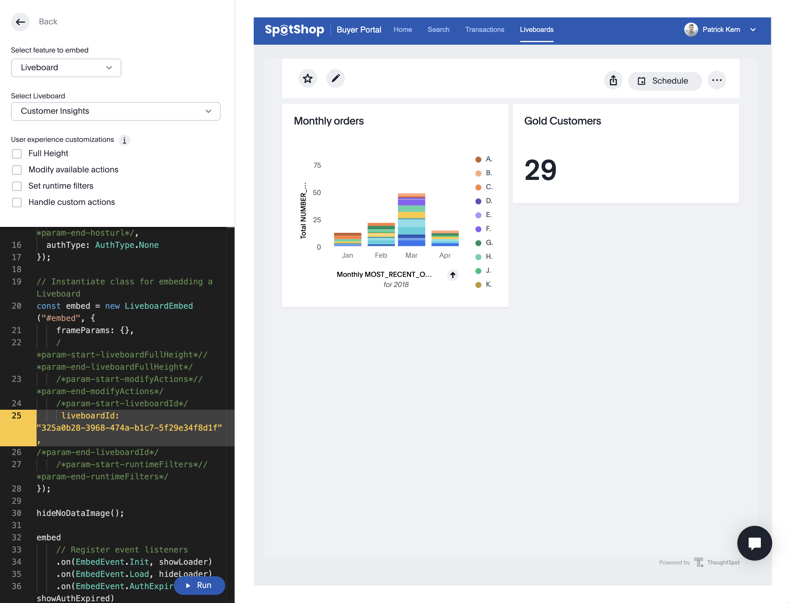


## Embed analytics into web app

Duration: 15

Now that you have your answerId and liveboardId, it’s time to start embedding them into your web app. We are going to use the Visual Embed SDK to add our Answers and Liveboards to a React-based web app. 
To make things easy, we will use Code Sandbox, a web based IDE and runtime environment for building web apps. 

Using Code Sandbox means we don’t need to spend time configuring our local environment for React development. The good news is that ThoughtSpot Everywhere uses the languages and developer processes you already know and love. If you already have your local environment setup for React development, feel free to use that. 

### Set up your project

In your browser, go to [codesandbox.io](http://codesandbox.io) and tap the **Create a Sandbox** button on the top right of the page, then select the **React** template. This will create a very simple web app, with code on the left, and rendered page on the right. 

Next, add the ThoughtSpot Visual Embed SDK as a dependency to your project. Type *@thoughtspot* into the dependency pane, then select the Visual Embed SDK from the autocomplete dropdown. 

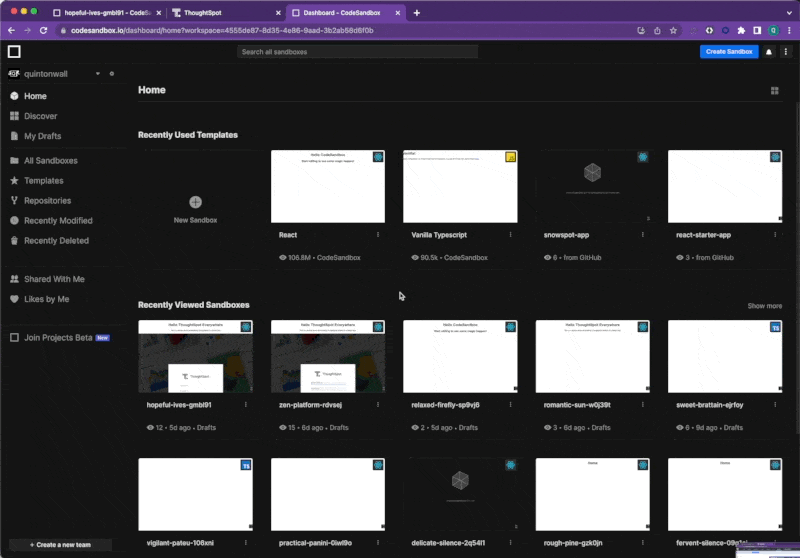

Replace the contents of `App.js` with the following code, and save your changes. Your ThoughtSpot trial URL may begin with `my1.thoughtspot.cloud` or  `my2.thoughtspot.cloud` instead of `try.thoughtspot.cloud`, so match it accordingly. Save your changes.

```react
import "./styles.css";
import { init, AuthType } from "@thoughtspot/visual-embed-sdk";

init({
  thoughtSpotHost: "https://try.thoughtspot.cloud",
  authType: AuthType.None
});

export default function App() {
  return (
    <div className="App">
      <h1>Hello ThoughtSpot Everywhere </h1>
      <p>This is a simple demo embedding ThoughSpot in a React App.</p>
     
    </div>
  );
}

```

You will notice that the code includes some logic to authenticate with ThoughtSpot. In this tutorial, we are using AuthType.None. This will prompt the user to log in when the page loads. This is fine for the tutorial, but not recommended for a production app. For a detailed overview of security options supported by the Visual Embed SDK, please check out the [online documentation](https://developers.thoughtspot.com/docs/?pageid=embed-auth). 

### Embed the Search Component

Let’s embed the “**Monthly orders**” Search Answer. Right click on the src folder in your project, and select New File. Call it `SearchComponent.js`. Then, add the following code, replace `YOUR-ANSWER-HERE` with the searchId you pasted into your clipboard, and save your changes. The Visual Embed SDK comes with React components to make embedding analytics incredibly easy. In addition to React, you can use Typescript, Vanilla JavaScript, or other frameworks just as easily.

```react
import "./styles.css";
import { init, AuthType } from "@thoughtspot/visual-embed-sdk";
import { SearchEmbed } from "@thoughtspot/visual-embed-sdk/react";

export const SearchComp = () => {
  return (
    <SearchEmbed
      frameParams={{ height: "80vw" }}
      answerId={"YOUR-ANSWERID-HERE"}
    />
  );
};
```

Next, update `App.js` to import the `SearchComponent` and render the results by adding the component within your App function:

```react
import { SearchComp } from "./SearchComponent";

init({
  thoughtSpotHost: "https://try.thoughtspot.cloud",
  authType: AuthType.None
});

export default function App() {
  return (
    <div className="App">
      <h1>Hello ThoughtSpot Everywhere </h1>
      <p>This is a simple demo embedding ThoughSpot in a React App.</p>
      <SearchComp />
    </div>
  );
}
```

As soon as you save your changes, the right hand frame will reload prompting you to log into ThoughtSpot. Once authenticated your Search Answer will render. You can click and interact with the results drilling down to further uncover insights. 

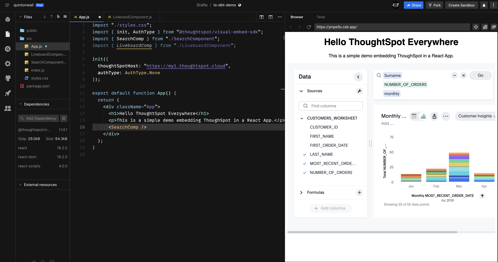

### Embed the Liveboard Component

Embedding a Liveboard component is very similar to embedding a Search component. Go ahead and create a new page in the `src` directory of your CodeSandbox project. Call it `LiveboardComponent.js`, and add the following code, replacing `YOUR-LIVEBOARD-HERE` with the `liveboardId` from your clipboard. If you no longer have the liveboardId, you can always get it from the Developer Playground.

```react
import { LiveboardEmbed } from "@thoughtspot/visual-embed-sdk/react";

export const LiveboardComp = () => {
  return (
    <LiveboardEmbed
      frameParams={{ height: "80vw" }}
      liveboardId={"YOUR-LIVEBOARDID-HERE"}
    />
  );
};
```

Then, modify `App.js` to import the `LiveboardComponent` and render that component instead of the `SearchComponent`. Your completed `App.js` should look similar to this:

```react
import "./styles.css";
import { init, AuthType } from "@thoughtspot/visual-embed-sdk";
import { SearchComp } from "./SearchComponent";
import { LiveboardComp } from "./LiveboardComponent";

init({
  thoughtSpotHost: "https://try.thoughtspot.cloud",
  authType: AuthType.None
});

export default function App() {
  return (
    <div className="App">
      <h1>Hello ThoughtSpot Everywhere </h1>
      <p>This is a simple demo embedding ThoughSpot in a React App.</p>
      <LiveboardComp />
    </div>
  );
}
```

Save your changes, and the Liveboard will now render within your app. Great job!

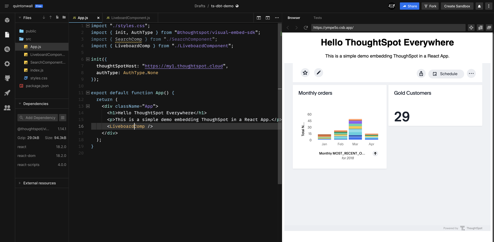

## Summary

Duration: 5

Thoughtout this tutorial you've created, connected, and implemented the major aspects of the modern data stack: you started with a Snowflake database and loading data into a schema, then leveraged dbt to model your data using modern development practices, and finally connected that dbt model to ThoughtSpot to derive analytics from the data to deliver business insights. Finally, you took the ThoughtSpot analytics and embedded them into a React-based web app to make it easier for all users to benefit. Sit back and congratuate yourself. It's time to have a well earned coffee.

